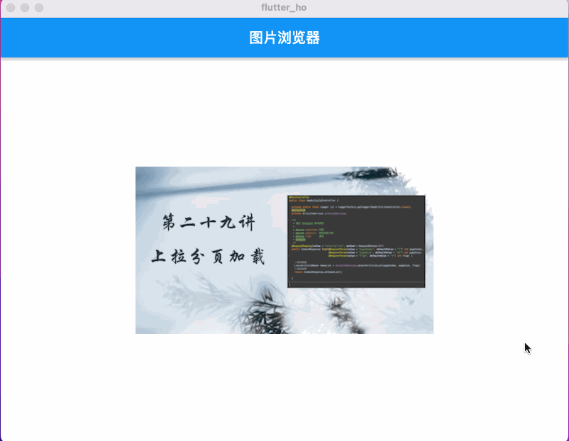

# flutter_ho

Flutter 快速开发模板  目录已适配到 Flutter 2.5版本

[Android apk体验](https://www.pgyer.com/KEYn)

## 1 Android 权限申请

权限申请使用的是  permission_handler: ^9.2.0

 需要在对应的清单文件中添加权限声明，如这里使用的相机

 android/app/src/main/AndroidManifest.xml


 ```
 <manifest xmlns:android="http://schemas.android.com/apk/res/android"
     package="com.studyyoun.flutter_ho">
     <uses-permission android:name="android.permission.CAMERA"/>
    <application .../>

  </manifest>
 ```
## 2 视频更新历程

*  2020 -12-05  第一天 [Flutter应用开发从0到1基础架构搭建效果预览](https://www.bilibili.com/video/BV1rZ4y1G7cK/)

* [***](https://github.com/zhaolongs/flutter-ho)

* 2021 -02-07 第四十二天 [Flutter GridView 标签选择 快速实现Demo 一键复制使用](https://www.zhihu.com/zvideo/1336809945681829889)[【源码】](https://github.com/zhaolongs/flutter-ho/tree/main/lib/src/pages/demo/demo3)
* 2021 -02-13 第四十三天 [Flutter跨平台开发APP 标签轮播切换 动画的组合灵感 第一篇](https://www.ixigua.com/6928734297964675592)[【源码】](https://github.com/zhaolongs/flutter-ho/tree/main/lib/src/pages/demo/demo4)
* 2021 -02-16 第四十四天 [Flutter跨平台开发APP 标签轮播切换 动画的组合灵感 第二篇](https://www.ixigua.com/6929107103776768516)[【源码】](https://github.com/zhaolongs/flutter-ho/tree/main/lib/src/pages/demo/demo4)
* 2021 -02-27 第四十五天 [Flutter滑动条 Slider 的详细配置使用](https://www.ixigua.com/6933784858019758595)[【源码】](https://github.com/zhaolongs/flutter-ho/blob/main/lib/src/pages/demo/demo5/slider_demo_page.dart)
* 2021 -02-27 第四十六天 [Flutter 一个图片浏览效果、共享轴动画](https://www.ixigua.com/6934297501512139276)[【源码】](https://github.com/zhaolongs/flutter-ho/blob/main/lib/src/pages/demo/demo6)


* 2021 -03-06 第四十七天 [Flutter跨平台App开发 自定义滚动选择标签 第一弹](https://www.zhihu.com/zvideo/1351533700161658880)[【源码】](https://github.com/zhaolongs/flutter-ho/blob/main/lib/src/pages/demo/demo7)
* 2021 -03-07 第四十八天 [Flutter跨平台App开发 自定义滚动选择标签 第二弹](https://www.zhihu.com/zvideo/1351534092543037440)[【源码】](https://github.com/zhaolongs/flutter-ho/blob/main/lib/src/pages/demo/demo7)

* 2021 -03-09 第四十九天 [Flutter 跨平台App开发 卡片展开的动画效果 Flutter 容器动画](https://www.zhihu.com/zvideo/1352926921022480384)[【源码】](https://github.com/zhaolongs/flutter-ho/blob/main/lib/src/pages/demo/demo8/animation_1_expand_card.dart)
* 2021 -03-11 第五十天 [Flutter App开发 PageView 动画图片浏览器 微动画视觉](https://www.zhihu.com/zvideo/1353261640809287680)[【源码】](https://github.com/zhaolongs/flutter-ho/blob/main/lib/src/pages/demo/demo8/animation_2_pageview_image.dart)

* 2022  -3-16 [Flutter 图片浏览器](https://www.zhihu.com/zvideo/1353261640809287680)[【源码】](https://github.com/zhaolongs/flutter-ho/blob/main/lib/src/pages/demo/demo38/image_show_page.dart)
* 2022  -3-19 [Flutter LayoutBuilder 布局构建者](https://www.zhihu.com/zvideo/1353261640809287680)[【源码】](https://github.com/zhaolongs/flutter-ho/blob/main/lib/src/pages/demo/demo38/layout_page.dart)


 ## 3 Demo大集合
 


 如果你迷茫 不妨来此 每日分享 先积累着再说
更多Widget 的应用，小编已总结在书中
* [手机点击查看](https://m.tb.cn/h.f6IsZcl?sm=b5555a ) # [电脑点击查看](https://detail.tmall.com/item.htm?id=658886049139)


***
* [手机点击查看](https://item.m.jd.com/product/10040957873690.html?&utm_source=iosapp&utm_medium=appshare&utm_campaign=t_335139774&utm_term=CopyURL&ad_od=share&utm_user=plusmember&gx=RnFjxjUIbWGNztQUp4J3XrJgfXzlaNZ0 ) # [电脑点击查看](https://item.jd.com/13009851.html)

